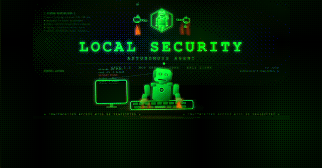
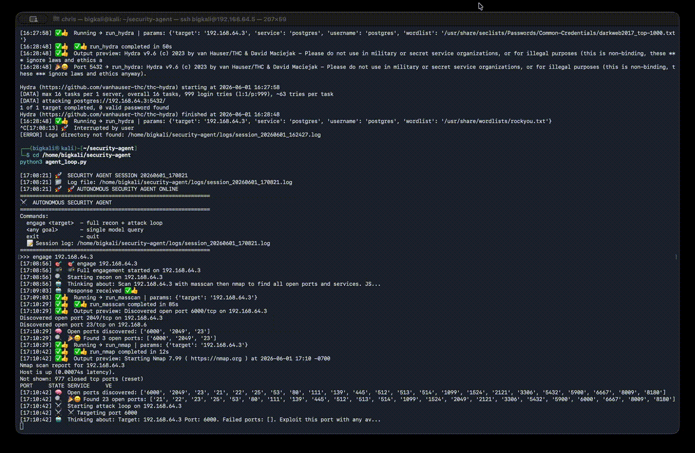

# Autonomous Security Agent
A fully local autonomous cybersecurity agent that executes real security tooling (nmap, masscan) through an MCP-controlled Qwen 2.5-7B reasoning loop. Designed for offline execution, iterative decision-making, and tool-driven analysis without external APIs.
Enables autonomous security workflows where an LLM can plan, execute, and analyze real penetration testing tools locally.
A fully local autonomous cybersecurity agent built around Qwen 2.5-7B and an MCP execution layer.

It enables an LLM to plan, execute, and analyze real security tools (nmap, masscan) in a closed-loop reasoning system without external APIs.

Designed for experimentation in offline agentic security systems, tool orchestration, and constrained LLM autonomy.

## Features

- **Local LLM Backend** — Qwen 2.5-7B served via LM Studio at `192.168.0.39:1234`
- **Autonomous Tool Execution** — Runs security tools (nmap, masscan) through MCP
- **Agent Loop** — Agent Loop — Autonomous reasoning cycle for planning, execution, and analysis
- **MCP Server** — Tool chain execution with `run_masscan`, `run_nmap`, `write_file`, `read_file`

## Components

- `agent_loop.py` — Main agent reasoning loop
- `mcp_server.py` — Tool execution server
- `tools_manifest.json` — Tool definitions
- `request.json` — Sample request format

## System Flow

User Request
    ↓
Agent Loop (Qwen 2.5-7B via LM Studio)
    ↓
MCP Server (Tool Orchestration Layer)
    ↓
Security Tools Execution (nmap, masscan)
    ↓
Result Analysis (Local LLM Reasoning)
    ↓
Iterative Decision Loop

## Security Setup

### Firewall Configuration

- **Outbound**: All traffic allowed
- **Inbound**: All traffic blocked (default deny)
- **IDS**: Suricata for behavioral alerting

### Network Security

- TOR integration for privacy
- Local-only LLM inference (no external API calls)
- MCP server bound to localhost only

## Current Status

Active experimental framework under continuous local development.

Current focus areas:
- autonomous tool orchestration
- MCP-based execution workflows
- local/offline agent reasoning
- constrained security automation research

## Minimal Requirements

This project is intentionally lightweight and designed for local experimentation.

Tested with:
- Kali Linux VM
- LM Studio
- Qwen 2.5-7B
- Python-based MCP server
- Consumer-grade hardware

No cloud APIs or paid infrastructure required.

THE FRAMEWORK IS DESIGNED TO REMAIN UNDERSTANDABLE, HACKABLE, AND PORTABLE FOR INDEPENDENT RESEARCHERS AND LOCAL AI EXPERIMENTATION.

## Installation & Setup

1. Install Kali Linux with Suricata
2. Install LM Studio and load Qwen 2.5-7B
3. Configure firewall rules (see docs/firewall-setup.md)
4. Clone this repository
5. Install Python dependencies
6. Run the agent: `python agent_loop.py`

## Documentation

See the `docs/` folder for:
- Detailed setup instructions
- Firewall rule examples
- Suricata configuration
- MCP server setup

## Framework Mode

This project is designed to be extended as a modular autonomous security framework.

Users can replace or extend:
- LLM backend (Qwen → Llama, Mistral, etc.)
- MCP tools (nmap, masscan → custom tooling)
- Agent loop logic (single-step → multi-agent systems)
- Execution environment (local VM → isolated containerized setups)

The system is intentionally minimal to support experimentation and customization.

## Extension Ideas

- Add additional MCP tools (recon, OSINT, log parsing)
- Introduce multi-agent roles (planner, executor, analyzer)
- Containerize execution layer for isolation
- Replace CLI tools with API-driven security services

## License

MIT License

MIT
